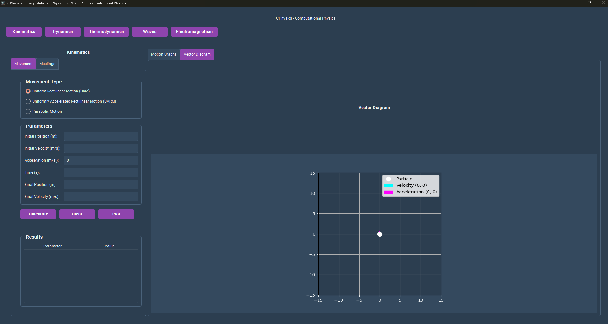

# CPhysics - Computational Physics Application

A modern desktop application for solving physics problems, featuring an intuitive graphical interface and advanced visualization capabilities.



## Features

- **Graphical Interface**: Developed with PySide6 (Qt for Python).
- **Physics Modules**:
    - **Kinematics**: Uniform Rectilinear Motion (URM) and Uniformly Accelerated Rectilinear Motion (UARM) calculations.
    - **Dynamics**: Calculations for Newton's Laws, energy, and momentum.
    - **Thermodynamics**: Covers thermodynamic processes.
    - **Waves**: Analysis of wave phenomena.
    - **Electromagnetism**: Solves problems related to electromagnetism.
- **Data Validation**: Robust system for input validation.
- **Interactive Plots**: Visualize results with Matplotlib.
- **Modular Architecture**: Easily extendable with new physics modules.
- **Responsive Design**: Adaptable interface with resizable panels.

## Technologies Used

- **PySide6**: GUI framework based on Qt6.
- **Matplotlib**: For generating scientific plots.
- **NumPy**: For efficient numerical calculations.
- **Pandas**: For data manipulation and analysis.
- **Python 3.8+**: The core programming language.

## Project Structure

```
CPhysics/
│
├── main.py                     # App entry point
├── gui/
│   ├── base_window.py          # Main window with navigation
│   ├── kinematics_frame.py     # UI for Kinematics
│   ├── dynamics_frame.py       # UI for Dynamics
│   ├── thermodynamics_frame.py # UI for Thermodynamics
│   ├── waves_frame.py          # UI for Waves
│   └── electromagnetism_frame.py # UI for Electromagnetism
│
├── modules/
│   ├── kinematics.py           # Physics functions for Kinematics
│   ├── dynamics.py             # Physics functions for Dynamics
│   ├── thermodynamics.py       # Physics functions for Thermodynamics
│   ├── waves.py                # Physics functions for Waves
│   └── electromagnetism.py     # Physics functions for Electromagnetism
│
├── assets/
│   └── icon.png                # Icons, images, etc.
│
├── utils/
│   └── validators.py           # Input validation, unit conversion
│
├── requirements.txt            # Project dependencies
└── README.md                   # This file
```

## Installation

### Prerequisites
- Python 3.8 or higher
- pip (Python package manager)

### Installation Steps

1.  **Clone the repository:**
    ```bash
    git clone https://github.com/xHJCXDx/CPhysics.git
    cd CPhysics
    ```

2.  **Create a virtual environment (recommended):**
    ```bash
    python -m venv .venv
    source .venv/bin/activate  # On Windows use `.venv\Scripts\activate`
    ```

3.  **Install the dependencies:**
    ```bash
    pip install -r requirements.txt
    ```

4.  **Run the application:**
    ```bash
    python main.py
    ```

## Usage

1.  **Launch the application**.
2.  **Select a physics module** from the main navigation (e.g., Kinematics, Dynamics).
3.  **Enter the known parameters** in the corresponding input fields.
4.  Click the **"Calculate"** button to see the results.
5.  Use the **"Plot"** button to visualize the data in interactive graphs.
6.  The **"Clear"** button resets the fields for a new problem.

## Contributing

Contributions are welcome! Please follow these steps:

1.  **Fork the project.**
2.  **Create a feature branch** (`git checkout -b feature/new-feature`).
3.  **Commit your changes** (`git commit -am 'Add new feature'`).
4.  **Push to the branch** (`git push origin feature/new-feature`).
5.  **Create a new Pull Request.**

### Areas for Contribution

- New physics modules.
- UI/UX improvements.
- Performance optimizations.
- Documentation and tutorials.
- Unit tests.
- Localization (i18n).

## License

This project is licensed under the MIT License. See the `LICENSE` file for more details.